# webview在app端的应用案例

## 天翼生活（所有页面都是webview）

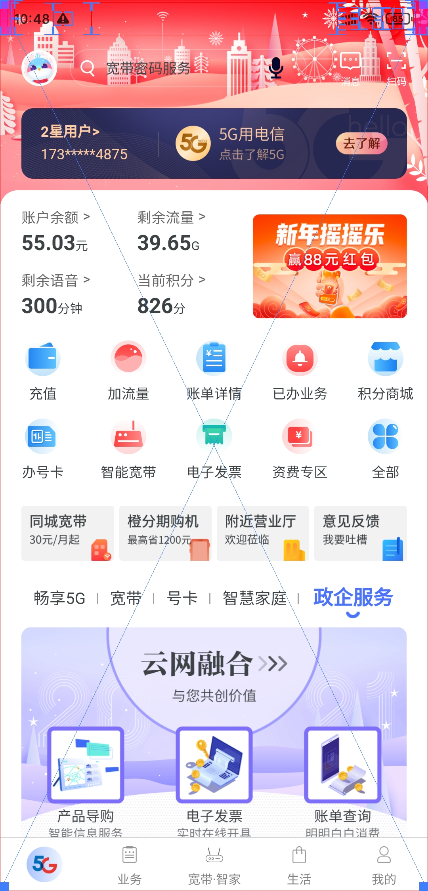

## 个人所得税（所有页面都是webview）

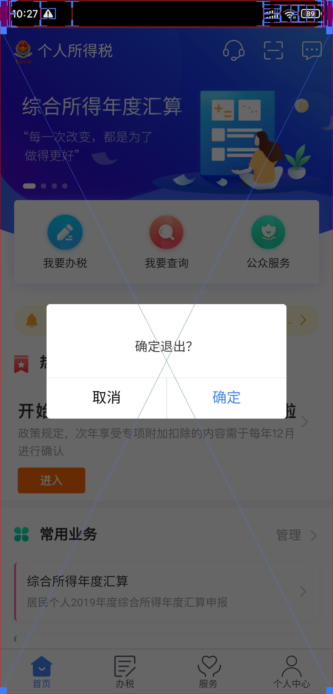

## 支付宝会员

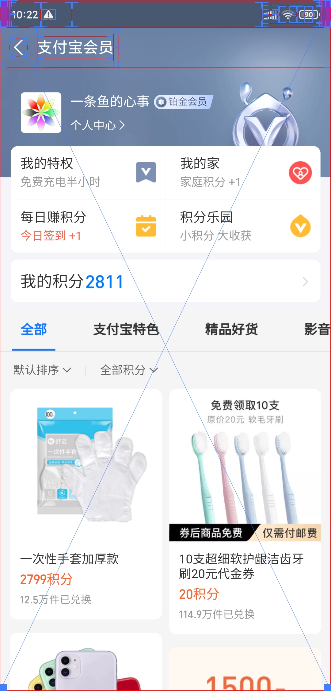

## 天猫超市

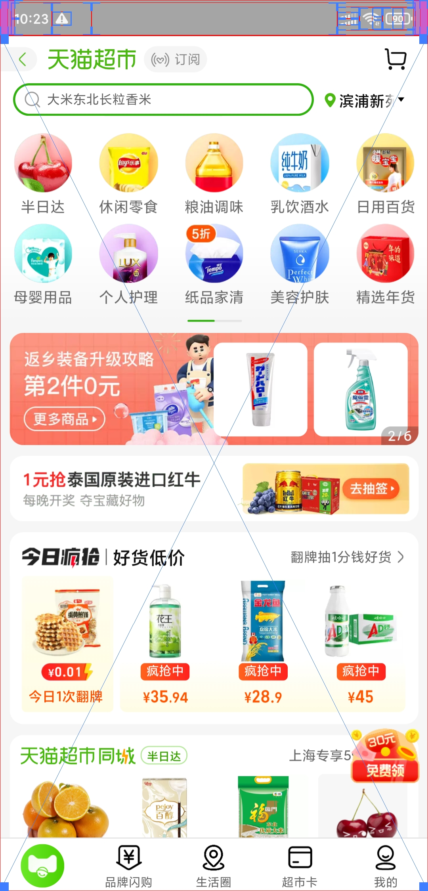

## 阿里健康

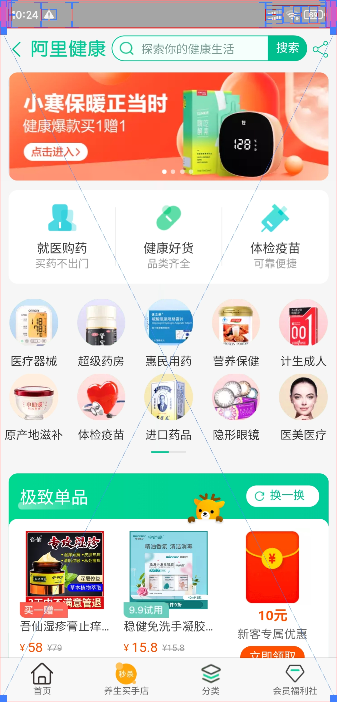

## 天猫国际

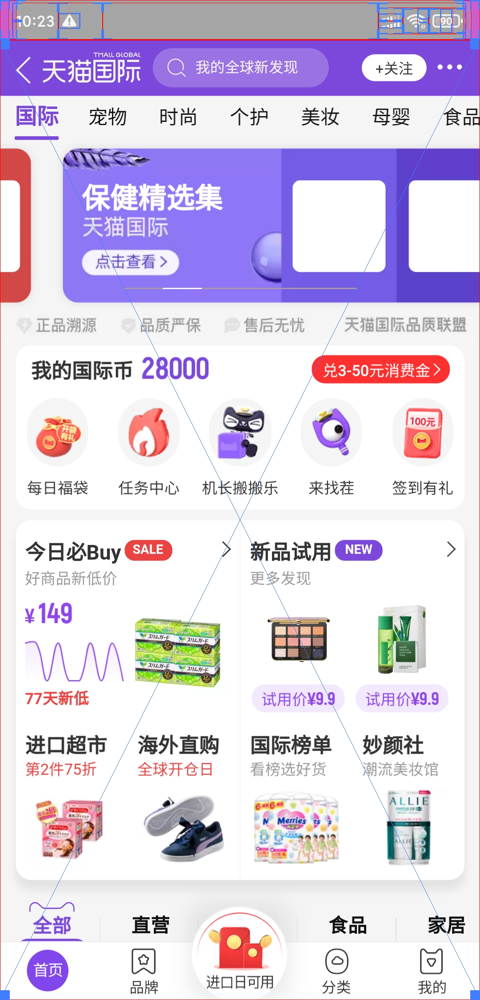

## 淘宝心选

## 拼多多首页上半部分的图标导航点进行的基本都是webview，比如限时秒杀，断码清仓，发现好货等

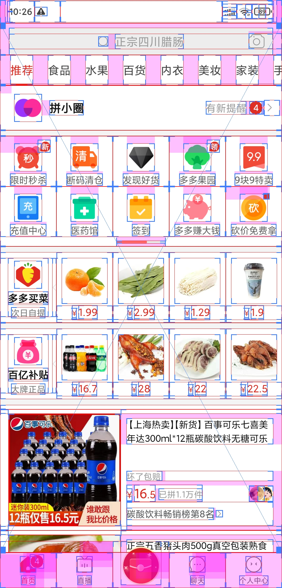

## 拼多多省钱月卡

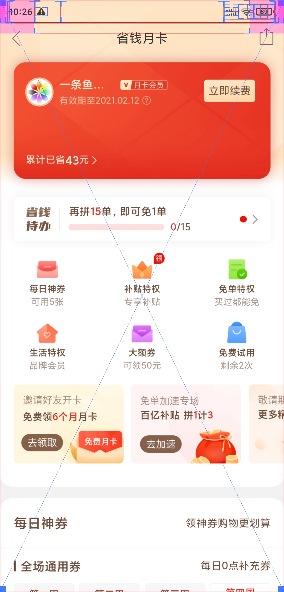

## 钉盘与文件

## 招商银行资讯

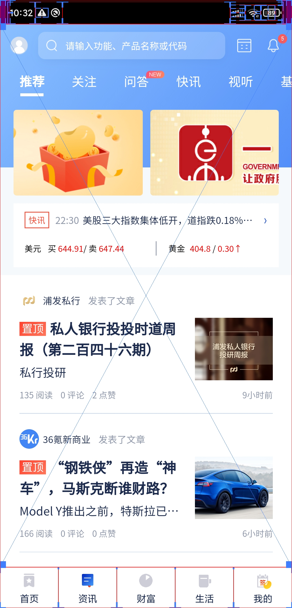

## 招商银行财富

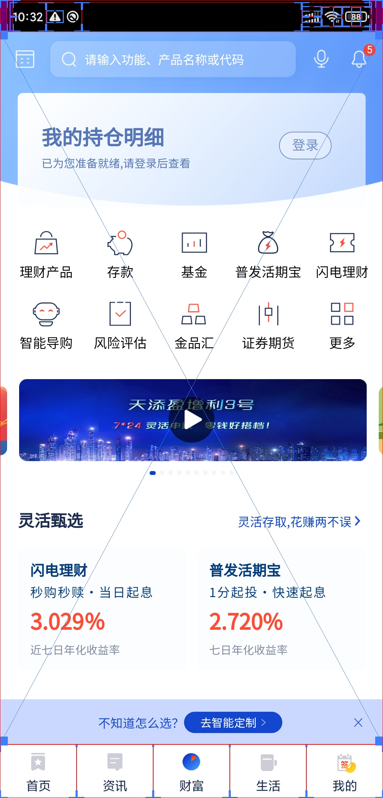

## 招商银行我的

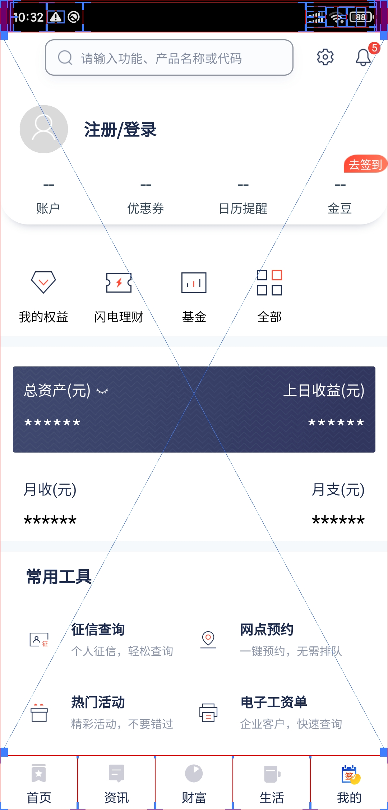

## 美团会员

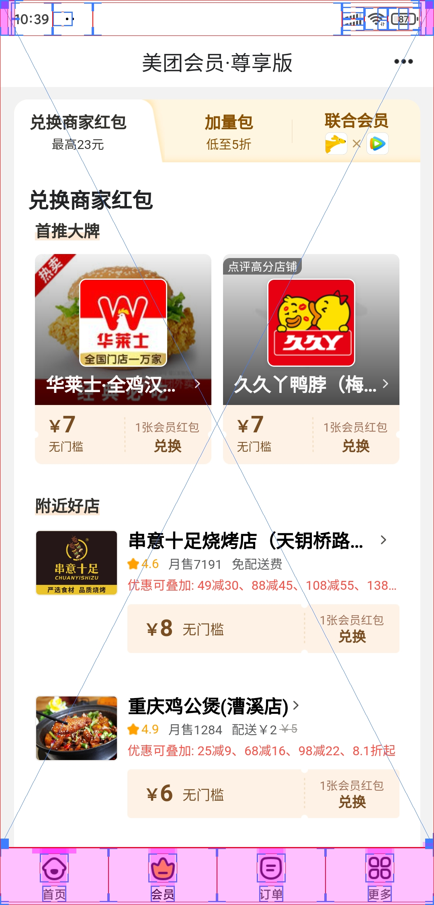

## 美团月付

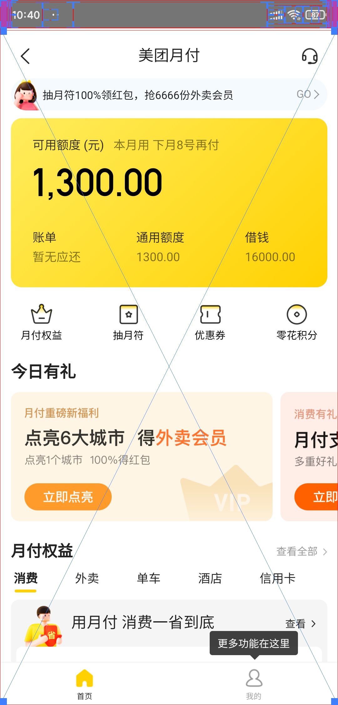

## 微信看一看

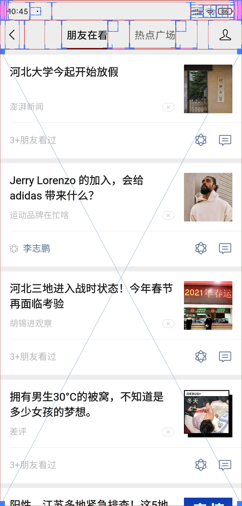

## 中国移动底部导航的前四个板块

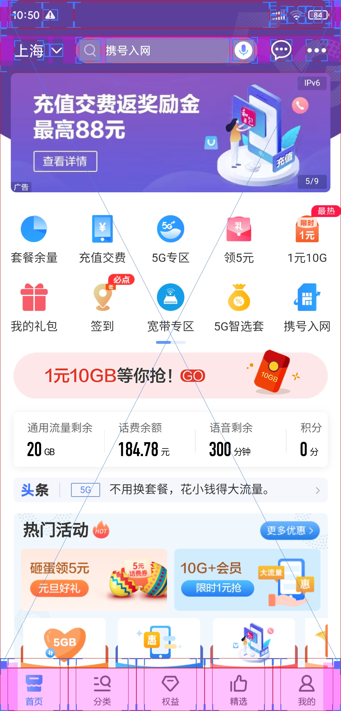
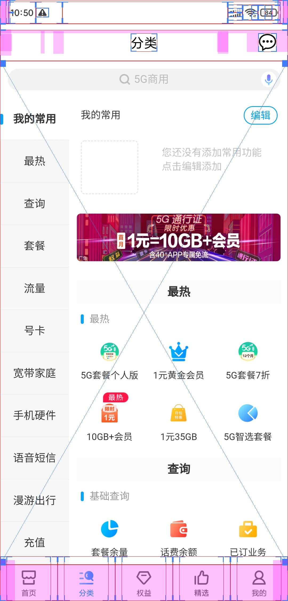
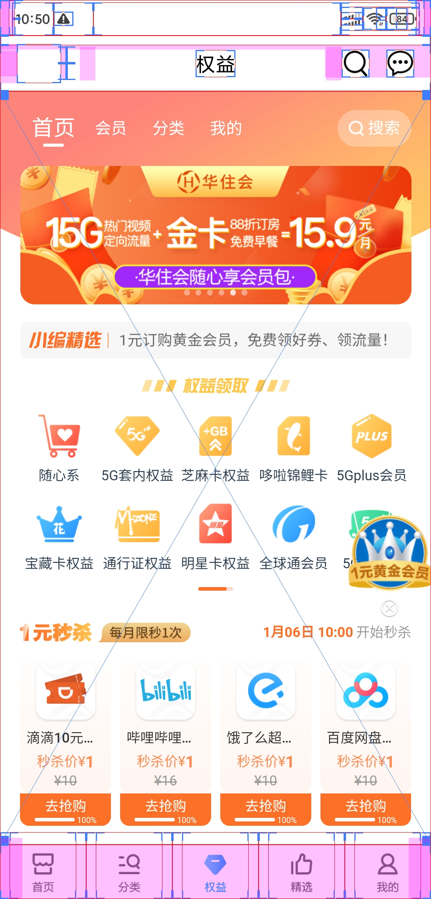
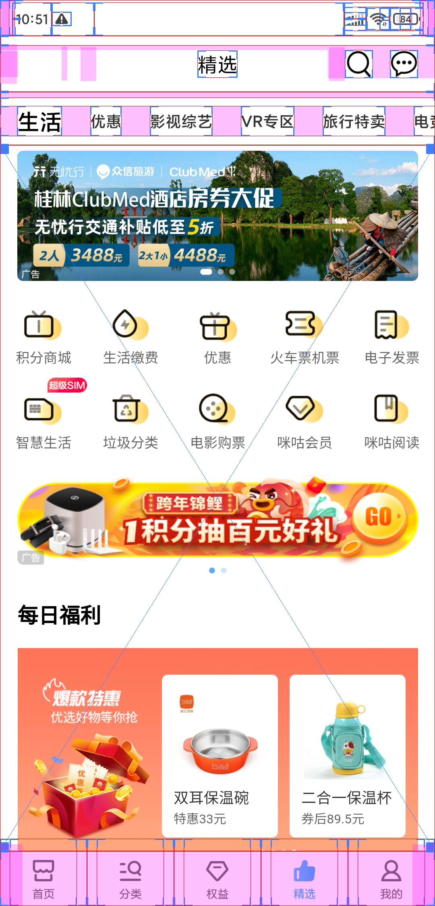
