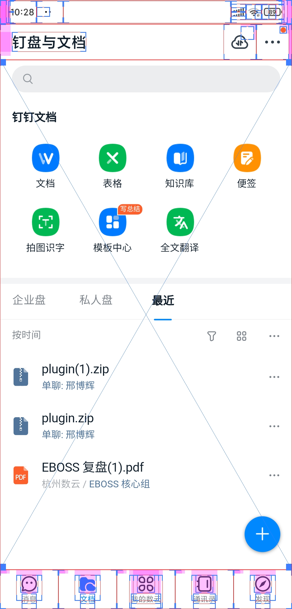

# webview在app端的应用案例

## 天翼生活（所有页面都是webview）

## 个人所得税（所有页面都是webview）

## 支付宝会员

## 天猫超市

## 阿里健康

## 天猫国际

## 淘宝心选

## 拼多多首页上半部分的图标导航点进行的基本都是webview，比如限时秒杀，断码清仓，发现好货等

## 拼多多省钱月卡

## 钉盘与文件

## 招商银行资讯

## 招商银行财富

## 招商银行我的

## 美团会员

## 美团月付

## 微信看一看

## 中国移动底部导航的前四个板块

